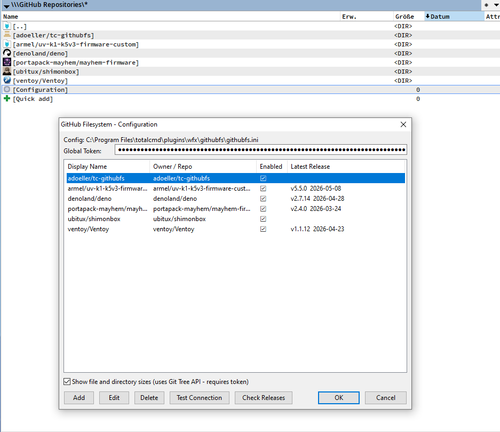

# GitHubFS - Total Commander File System Plugin

Browse GitHub repositories as a virtual file system directly in Total Commander's Network Neighborhood.

## Features

- 🌟 **Repository Browsing:** Navigate repositories, branches, and directories as virtual folders
- 🌟 **File Viewing:** Open text files, Markdown, images, and more directly in Total Commander's lister
- 🌟 **Download Support:** Download individual files or entire directories
- 🌟 **Repository Management:** Add, edit, and remove repositories through the settings dialog
- 🌟 **Secure Authentication:** Use GitHub Personal Access Tokens for secure access to your repositories
- 🌟 **Release Management:** View and navigate releases for each repository
- 🌟 **Latest Release Tracking:** Automatically check and highlight the latest release for each repository
- 🌟 **Sortable Repository List:** Sort your repositories by name, owner, latest release, and more

## Setup

1. Install the plugin by copying `GitHubFS.wfx64` to your Total Commander plugins directory
2. Open Total Commander and go to Network Neighborhood
3. Right-click and choose "Add New FTP Connection"
4. Select "GitHubFS" from the list of plugins
5. Click "New" to add your GitHub repositories

### Creating a GitHub Personal Access Token

To access your repositories, you need to create a GitHub Personal Access Token:

1. Log in to your GitHub account
2. Click on your avatar in the top right corner and choose "Settings"
3. In the left sidebar, navigate to "Developer Settings" → "Personal Access Tokens" → "Tokens (classic)"
4. Click "Generate new token" then "Generate new token (classic)"
5. Give your token a name, e.g., "TC WFX Plugin"
6. Grant the necessary permissions:
   - For full access: Check "repo" to grant access to all repository-related endpoints
   - For more secure, granular access: Check "contents" (Read-only) and "metadata" (Read-only)
7. Click "Generate token"
8. Copy the generated token (it will only be shown once) and paste it into the GitHubFS settings dialog

For maximum security, it's recommended to:
- Use granular scopes instead of the broad "repo" scope
- Create separate tokens for public and private repositories
- Only grant read access (the plugin doesn't need write permissions)

## Usage

- Expand the GitHubFS entry in Network Neighborhood to browse your repositories
- Double-click files to open them in the viewer
- Right-click files or directories to download them
- Use Alt+Enter on a repository to edit its settings
- Click the "Check Releases" button in the settings dialog to fetch the latest release info for all repositories
- Click column headers in the settings dialog to sort your repositories

## Feedback & Contributions

If you encounter any issues, have suggestions, or want to contribute to the project, please open an issue or submit a pull request on the [GitHubFS GitHub repository](https://github.com/adoeller/GitHubFS).

Enjoy browsing your GitHub repositories in Total Commander with GitHubFS! 🚀
