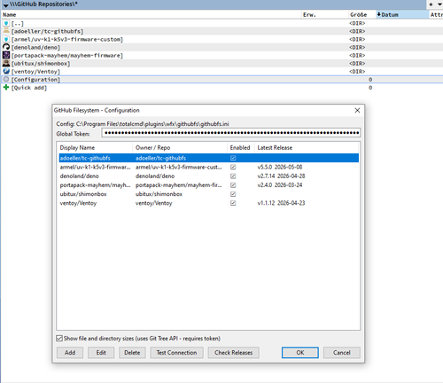
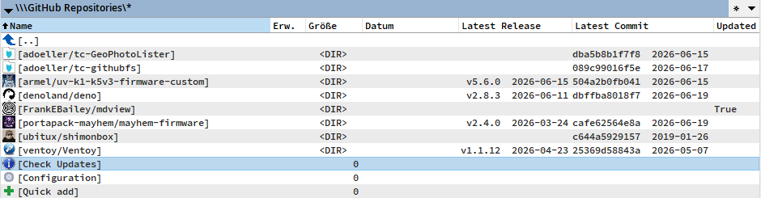

# GitHubFS - Total Commander File System Plugin

Browse GitHub repositories as a virtual file system directly in Total Commander's Network Neighborhood.


## Features

- 🌟 **Repository Browsing:** Navigate repositories, branches, and directories as virtual folders
- 🌟 **File Viewing:** Open text files, Markdown, images, and more directly in Total Commander's lister
- 🌟 **File Transfer:** Download files and upload files to configured repository branches
- 🌟 **Write Support:** Upload, delete, copy, move, or rename files in configured repository branches
- 🌟 **Repository Management:** Add, edit, and remove repositories through the settings dialog
- 🌟 **Secure Authentication:** Use GitHub Personal Access Tokens for secure access to your repositories
- 🌟 **Release Management:** View and navigate releases for each repository
- 🌟 **Latest Release Tracking:** Automatically check and highlight the latest release for each repository
- 🌟 **Sortable Repository List:** Sort your repositories by name, owner, latest release, and more

## Setup

1. Install the plugin by copying `GitHubFS.wfx64` to your Total Commander plugins directory
2. Open Total Commander and go to Network Neighborhood
3. Right-click and choose "Add New FTP Connection"
4. Select "GitHubFS" from the list of plugins
5. Click "New" to add your GitHub repositories

### Creating a GitHub Personal Access Token

To access your repositories, you need to create a GitHub Personal Access Token:

1. Log in to your GitHub account
2. Click on your avatar in the top right corner and choose "Settings"
3. In the left sidebar, navigate to "Developer Settings" → "Personal Access Tokens" → "Tokens (classic)"
4. Click "Generate new token" then "Generate new token (classic)"
5. Give your token a name, e.g., "TC WFX Plugin"
6. Grant the necessary permissions:
   - For full access: Check "repo" to grant access to all repository-related endpoints
   - For more secure, granular access: Check "contents" (Read and write) and "metadata" (Read-only)
7. Click "Generate token"
8. Copy the generated token (it will only be shown once) and paste it into the GitHubFS settings dialog

For maximum security, it's recommended to:
- Use granular scopes instead of the broad "repo" scope
- Create separate tokens for public and private repositories
- If you only browse repositories, grant `contents` read access. Uploading or
  renaming files requires `contents` read and write access (or classic `repo`).

## Usage

- Expand the GitHubFS entry in Network Neighborhood to browse your repositories
- Double-click files to open them in the viewer
- Right-click files or directories to download them
- Copy a local file into a repository branch to upload it. Existing files are
  overwritten only after Total Commander confirms the overwrite.
- Copy, move, or rename a file inside the same repository branch with Total
  Commander. A move or rename creates the new file, then removes the old file.
- Delete a repository file with Total Commander's delete command. Deleting a
  repository entry itself still only removes that entry from the plugin configuration.
- Delete a directory recursively with Total Commander's delete command. Its
  contained files are removed together in one Git commit.
  Directory creation, cross-repository moves, and release entries are not writable.
- Uploads are limited to 64 MiB per file to keep both 32-bit and 64-bit plugin
  processes within a predictable memory budget.
- Use Alt+Enter on a repository to edit its settings
- Click the "Check Updates" button in the settings dialog to fetch latest release and latest commit info for all repositories
  - Repositories with an access token are checked for releases via a GraphQL batch request
  - Repositories without a token use the REST release API individually
- Double-click the "Latest Release" or "Latest Commit" cells to jump to the stored release/commit path
- Click column headers in the settings dialog to sort your repositories
- Open `[Check Updates]` in the GitHubFS root to run the same update check
  without opening the configuration dialog
- Both update checks run GitHub requests on a background thread. Their progress
  displays keep processing window messages during slow requests. Configuration
  changes are temporarily disabled until the check finishes.
  During release queries only a status message is shown; the subsequent progress
  bar counts repositories once each while checking their latest commits.

### Custom columns

GitHubFS provides four repository columns for Total Commander:

- `Latest Release` shows the release tag and date stored by the update check
- `Latest Commit` shows the short commit SHA and date stored by the update check
- `Latest Commit Date` shows only the stored commit date
- `Updated` shows `True` when the most recent update check detected a changed release or commit; otherwise it is empty

## Configuration

GitHubFS stores its settings in `githubfs.ini` next to the plugin files.

The `[Settings]` section supports:

```ini
[Settings]
AutoUpdateRepos=0
ShowUpdateBox=0
ShowSources=0
AskCommitMessage=0
DefaultCommitMessage=Update via Total Commander
```

- `AutoUpdateRepos=0` disables automatic update checks when opening the settings dialog (default)
- `AutoUpdateRepos=1` runs the same action as the "Check Updates" button immediately when the settings dialog opens
- `ShowUpdateBox=0` refreshes the panel silently after the root update check (default)
- `ShowUpdateBox=1` additionally shows the update summary dialog
- `ShowSources=0` hides GitHub's automatically generated source archives (default)
- `ShowSources=1` shows `Source code.zip` and `Source code.tar.gz` inside each release
- `AskCommitMessage=0` uses `DefaultCommitMessage` for uploads, deletes, copies, moves, and renames
- `AskCommitMessage=1` asks for the commit message before each write operation and pre-fills the last confirmed text

### Language files

`Language=auto` is the default and follows Total Commander's configured
language. Set `Language` explicitly to a language code to override it. The plugin automatically
loads `language\githubfs.<code>.lng` from the plugin directory. For example,
`Language=fr` loads `githubfs.fr.lng`; `Language=pt-BR` loads
`githubfs.pt-br.lng`. Missing strings fall back to `language\githubfs.en.lng`.

Language files use an INI `[Strings]` section, for example:

```ini
[Strings]
RootName=Depots GitHub
ConfigurationTitle=Systeme de fichiers GitHub - Configuration
```

Each repository section stores the last checked release and commit metadata when known:

```ini
[Repo1]
LatestRelease=v1.2.3
LatestReleaseDate=2026-06-01T12:34:56Z
LatestReleasePath=\MyRepo\[Releases]\v1.2.3
LatestCommitSHA=0123456789abcdef0123456789abcdef01234567
LatestCommitDate=2026-06-17T08:15:00Z
LatestCommitPath=\MyRepo\main
```

## Feedback & Contributions

If you encounter any issues, have suggestions, or want to contribute to the project, please open an issue or submit a pull request on the [GitHubFS GitHub repository](https://github.com/adoeller/GitHubFS).

Enjoy browsing your GitHub repositories in Total Commander with GitHubFS! 🚀
